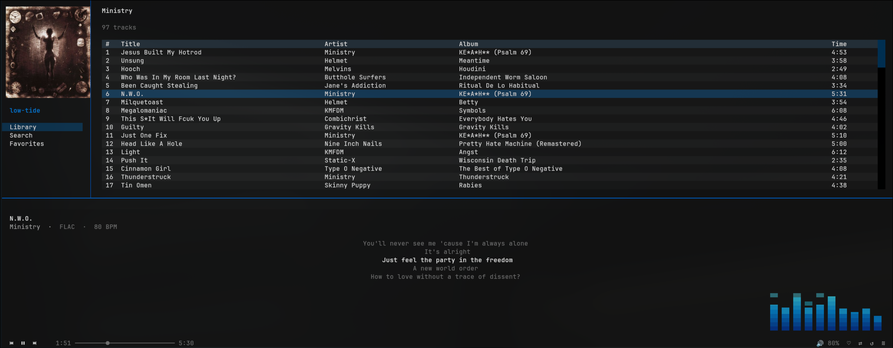

# low-tide

A terminal UI client for [TIDAL](https://tidal.com), built with Python. Browse your library, search, and play music without leaving the terminal – album art included.




> **Disclaimer:** low-tide is an independent, unofficial project. It is not affiliated with, endorsed by, or supported by TIDAL Music AS. It uses the unofficial [tidalapi](https://github.com/tamland/python-tidal) library to access TIDAL's API. Use at your own risk – this may break if TIDAL changes their API, and use of unofficial API access may violate TIDAL's terms of service.

---

## Features

### Playback
- Full audio playback via `mpv` – no browser, no Electron
- Shuffle, repeat, and crossfade (with configurable fade duration)
- ReplayGain normalisation – album or track mode via mpv
- ALSA direct output for bit-perfect playback (optional, see [Configuration](#configuration))
- Stream quality from 96 kbps AAC up to Hi-Res Lossless (TIDAL MAX)

### Library and browsing
- Browse playlists, favourites, mixes, and TIDAL's For You recommendations
- Search tracks, albums, and artists
- Album and artist drill-down views
- Love / unlove tracks – syncs with TIDAL favourites
- Local library – browse and play locally stored files (FLAC, MP3, OPUS, OGG, M4A); metadata read via mutagen, library cached for fast startup

### Queue
- Add tracks to the queue without interrupting playback – press `a` on any track to add it, or `A` to add the entire album, playlist, or favourites list
- Queue persists across restarts – picks up where you left off

### Now playing
- Synced lyrics displayed in the player bar, scrolling in time with playback
- Track info – BPM, audio quality, and explicit flag
- Album art rendered inline using the kitty graphics protocol

### Integrations
- **MPRIS2** – media keys, `playerctl`, and desktop now-playing panels
- **Last.fm scrobbling** – configured via `config.json` (see [Configuration](#configuration))

### Interface
- Transparent UI designed for GPU-accelerated terminals
- Queue panel toggle
- Keyboard-first with mouse click support for track selection

## Requirements

**low-tide is Linux-only.** It relies on Unix sockets for mpv IPC, D-Bus for MPRIS, and the kitty graphics protocol for album art. macOS and Windows are not supported.

- **Python 3.11+**
- **A TIDAL subscription** (HiFi or higher recommended for lossless playback)
- **mpv** – for audio playback (must be installed separately)
- **kitty terminal** (recommended) – for inline album art; other terminals will work without art

### Installing mpv

```bash
# Arch / CachyOS
sudo pacman -S mpv

# Ubuntu / Debian
sudo apt install mpv
```

## Installation

```bash
git clone https://github.com/pauljhdrake/low-tide.git
cd low-tide
pip install .
```

This installs all Python dependencies and adds a `low-tide` command to your PATH. A virtual environment is recommended:

```bash
python -m venv .venv
source .venv/bin/activate        # bash/zsh
source .venv/bin/activate.fish   # fish
pip install .
```

For an editable install (if you want to hack on it):

```bash
pip install -e .
```

## Running

```bash
low-tide
```

On first launch you will be prompted to authenticate with TIDAL via a device-code login – a URL is printed, open it in your browser and follow the prompts. Tokens are saved to `~/.config/low-tide/session.json` and reused on future launches.

## Authentication and Token Handling

low-tide uses TIDAL's OAuth 2.0 device-code flow. Your TIDAL password is never seen or stored by this app – you authenticate directly with TIDAL in your browser.

After login, TIDAL issues an access token and a refresh token. These are stored **locally on your machine** at:

```
~/.config/low-tide/session.json
```

This file:
- is never read by anything other than low-tide on your machine
- is excluded from the repository via `.gitignore` and will never be committed
- contains no password – only the OAuth tokens issued by TIDAL
- can be revoked at any time by contacting TIDAL support or deleting the file (you will be prompted to re-authenticate on next launch)

The source code for token handling is in [`lowtide/tidal_client.py`](lowtide/tidal_client.py) if you want to inspect it.

## Keybindings

| Key | Action |
|-----|--------|
| `space` | Play / Pause |
| `n` | Next track |
| `p` | Previous track |
| `]` / `[` | Volume up / down |
| `s` | Toggle shuffle |
| `r` | Toggle repeat |
| `l` | Love / unlove current track |
| `x` | Toggle crossfade |
| `a` | Add focused track to queue |
| `A` | Add all tracks in current view to queue |
| `q` | Toggle queue panel |
| `ctrl+s` | Go to Search |
| `ctrl+l` | Go to Library |
| `escape` | Navigate back |
| `ctrl+q` | Quit |

## Transparency

low-tide uses transparent backgrounds throughout. For the full effect with your desktop wallpaper showing through, enable background opacity in kitty:

```ini
# ~/.config/kitty/kitty.conf
background_opacity 0.85
```

## Configuration

Create `~/.config/low-tide/config.json` to override defaults:

```json
{
  "quality": "lossless"
}
```

| Key | Values | Default | Description |
|-----|--------|---------|-------------|
| `quality` | `"low"` `"high"` `"lossless"` `"max"` | `"lossless"` | Stream quality. `"max"` requires a TIDAL Max subscription. |
| `music_dir` | string or array | — | Local music directory or directories. Adds a Local section to the sidebar. e.g. `"/home/user/Music"` or `["/home/user/Music", "/mnt/nas/Music"]` |
| `replaygain` | `"album"` `"track"` `"no"` | `"album"` | ReplayGain mode. `"album"` preserves intended volume differences between tracks on the same album; `"track"` normalises every track to the same loudness. |
| `alsa_output` | `true` / `false` | `false` | Route audio directly to ALSA, bypassing PulseAudio/PipeWire. Useful for bit-perfect output. |
| `alsa_device` | string | system default | ALSA device name, e.g. `"hw:0,0"`. |
| `alsa_bit_depth` | `16` `24` `32` | `32` | Output bit depth when using ALSA. |
| `alsa_samplerate` | integer | source rate | Output sample rate when using ALSA, e.g. `192000`. |
| `crossfade` | integer | `5` | Crossfade duration in seconds when crossfade is enabled (toggle with `x`). Crossfade is off at startup regardless of this value. |

To enable Last.fm scrobbling, add a `lastfm` block. Get an API key at [last.fm/api](https://www.last.fm/api/account/create). `password_hash` is the MD5 hash of your password — generate it with `python3 -c "import hashlib; print(hashlib.md5('yourpassword'.encode()).hexdigest())"`.

```json
{
  "lastfm": {
    "api_key": "your_api_key",
    "api_secret": "your_api_secret",
    "username": "your_username",
    "password_hash": "md5_of_your_password"
  }
}
```

Example for bit-perfect TIDAL MAX output:

```json
{
  "quality": "max",
  "replaygain": "no",
  "alsa_output": true,
  "alsa_device": "hw:0,0",
  "alsa_bit_depth": 32,
  "alsa_samplerate": 192000
}
```

## Known Limitations

- **Unofficial API** – relies on [tidalapi](https://github.com/tamland/python-tidal), which may break when TIDAL updates their backend
- **mpv required** – audio playback depends on mpv being installed as a system package
- **Album art requires kitty** – the kitty graphics protocol is used for inline images; other terminals will show the app without art
- **No MQA/Atmos support** – stream quality depends on your subscription; format handling is delegated to mpv

## Project Structure

```
lowtide/
  main.py            # entry point
  tidal_client.py    # tidalapi wrapper
  player.py          # mpv IPC control
  app.py             # app layout: sidebar, content area, queue panel
  screens/           # library, search, playlist, album, artist, favorites
  widgets/           # now_playing bar, track list table, album art
```

## License

MIT – see [LICENSE](LICENSE) for details.

This project is not affiliated with or endorsed by TIDAL Music AS. TIDAL is a registered trademark of TIDAL Music AS.
