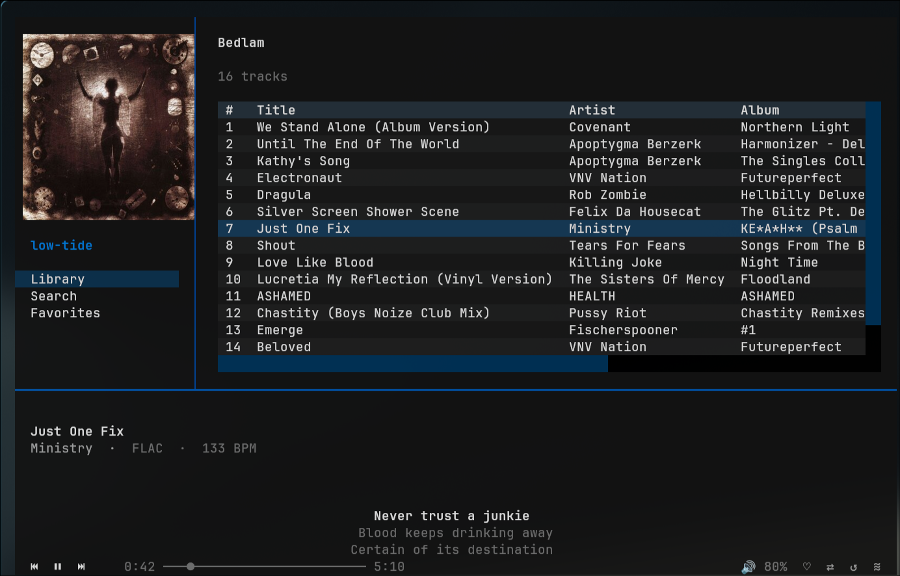

# low-tide

A terminal UI client for [TIDAL](https://tidal.com), built with Python. Browse your library, search, and play music without leaving the terminal — album art included.




> **Disclaimer:** low-tide is an independent, unofficial project. It is not affiliated with, endorsed by, or supported by TIDAL Music AS. It uses the unofficial [tidalapi](https://github.com/tamland/python-tidal) library to access TIDAL's API. Use at your own risk — this may break if TIDAL changes their API, and use of unofficial API access may violate TIDAL's terms of service.

---

## Features

- Browse playlists, favourites, mixes, and TIDAL's For You recommendations
- Search tracks, albums, and artists
- Full audio playback via `mpv` — no browser, no Electron
- Album art rendered inline using the kitty graphics protocol
- Queue management with keyboard navigation
- Album and artist drill-down views
- Transparent UI designed for GPU-accelerated terminals

## Requirements

- **Python 3.11+**
- **A TIDAL subscription** (HiFi or higher recommended for lossless playback)
- **mpv** — for audio playback (must be installed separately)
- **kitty terminal** (recommended) — for inline album art; other terminals will work without art

### Installing mpv

```bash
# Arch / CachyOS
sudo pacman -S mpv

# Ubuntu / Debian
sudo apt install mpv

# macOS
brew install mpv
```

## Installation

```bash
git clone https://github.com/pauljhdrake/low-tide.git
cd low-tide
pip install .
```

This installs all Python dependencies and adds a `low-tide` command to your PATH. A virtual environment is recommended:

```bash
python -m venv .venv
source .venv/bin/activate        # bash/zsh
source .venv/bin/activate.fish   # fish
pip install .
```

For an editable install (if you want to hack on it):

```bash
pip install -e .
```

## Running

```bash
low-tide
```

On first launch you will be prompted to authenticate with TIDAL via a device-code login — a URL is printed, open it in your browser and follow the prompts. Tokens are saved to `~/.config/low-tide/session.json` and reused on future launches.

## Keybindings

| Key | Action |
|-----|--------|
| `space` | Play / Pause |
| `n` | Next track |
| `p` | Previous track |
| `]` / `[` | Volume up / down |
| `q` | Toggle queue panel |
| `ctrl+s` | Go to Search |
| `ctrl+l` | Go to Library |
| `escape` | Navigate back |
| `ctrl+q` | Quit |

## Transparency

low-tide uses transparent backgrounds throughout. For the full effect with your desktop wallpaper showing through, enable background opacity in kitty:

```ini
# ~/.config/kitty/kitty.conf
background_opacity 0.85
```

## Known Limitations

- **Unofficial API** — relies on [tidalapi](https://github.com/tamland/python-tidal), which may break when TIDAL updates their backend
- **mpv required** — audio playback depends on mpv being installed as a system package
- **Album art requires kitty** — the kitty graphics protocol is used for inline images; other terminals will show the app without art
- **No MQA/Atmos support** — stream quality depends on your subscription; format handling is delegated to mpv

## Contributing

Contributions are welcome. Please open an issue before starting significant work so we can discuss the approach. For smaller fixes, a PR is fine directly.

When contributing:
- Create a feature branch (`feat/description`) or fix branch (`fix/description`)
- Keep PRs focused — one thing per PR
- The project has no test suite yet, so manual testing notes in the PR description are appreciated

## Project Structure

```
lowtide/
  main.py            # entry point
  tidal_client.py    # tidalapi wrapper
  player.py          # mpv IPC control
  app.py             # app layout: sidebar, content area, queue panel
  screens/           # library, search, playlist, album, artist, favorites
  widgets/           # now_playing bar, track list table, album art
```

## License

MIT — see [LICENSE](LICENSE) for details.

This project is not affiliated with or endorsed by TIDAL Music AS. TIDAL is a registered trademark of TIDAL Music AS.
